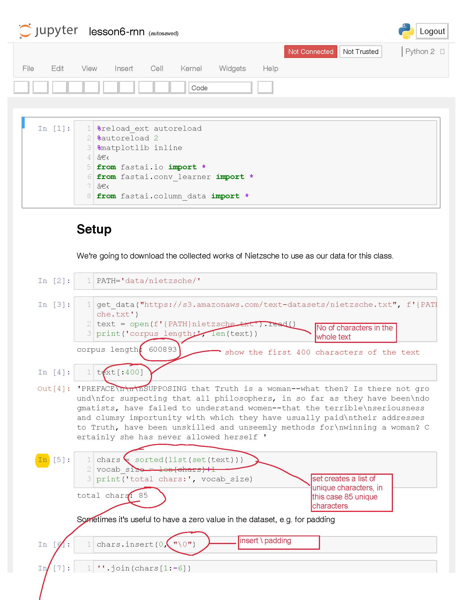
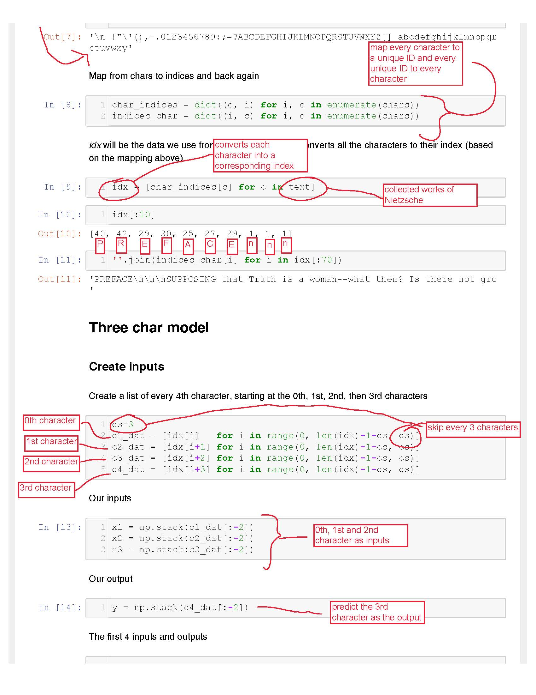
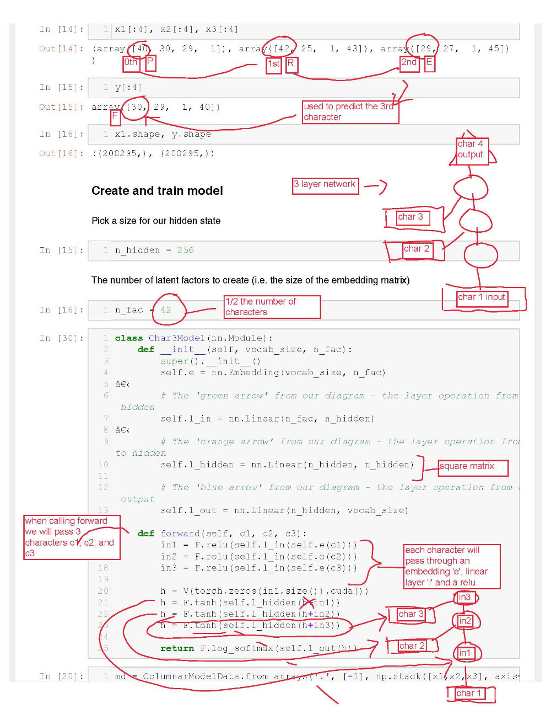
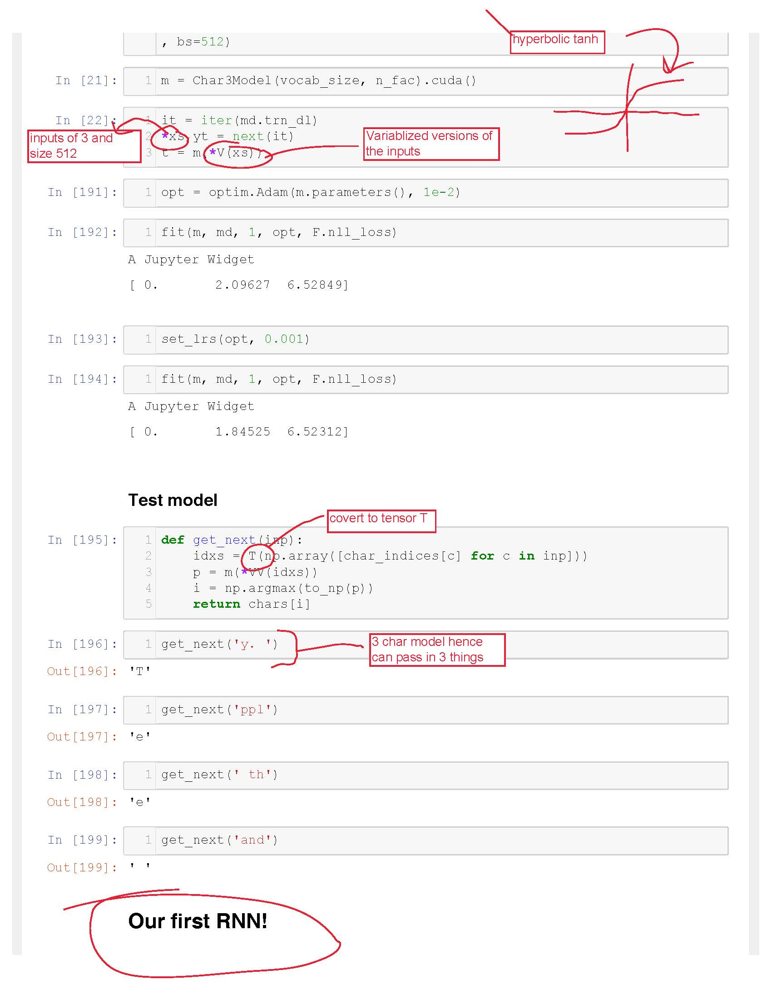

# fastai_v2_P1_resources
Fastai version 2 part 1 (October 2017 class)

# Course Links
[Fastai version 2 repository](https://github.com/fastai/fastai)

# Lesson Notes
Lesson 1 Cats and Dogs notes: [Fastai Forum](http://forums.fast.ai/t/cats-and-dogs-code-notes/7561) | [PDF Link](images/lesson1_notes.pdf "PDF Link")

Lesson 6 Nietzsche notes: [Fastai Forum](http://forums.fast.ai/t/nietzsche-notes-lesson-6/8682) | [PDF Link](images/lesson6-rnn_notes.pdf "PDF Link")

 

Lesson 7 CIFAR-10 notes: [Fastai Forum](http://forums.fast.ai/t/cifar-10-notes-lesson-7/8888) | [PDF Link](images/lesson7-cifar10_notes.pdf "PDF Link")

# Resources
[AWS setup](https://github.com/reshamas/fastai_deeplearn_part1/blob/master/tools/aws_ami_gpu_setup.md) - thanks to Reshamas

[Kaggle setup](https://github.com/reshamas/fastai_deeplearn_part1/blob/master/tools/download_data_kaggle_cli.md)- thanks to Reshamas

[Uploading data to AWS](https://github.com/asvcode/fastai_v2_P1_resources/blob/master/Uploading%20data%20to%20AWS.md) - quick guide on how to upload your data to AWS using FileZilla

