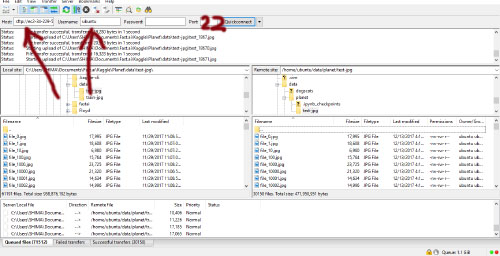

# How to upload data to AWS using FileZilla

1) [Setting up an AWS instance is discussed here](https://github.com/reshamas/fastai_deeplearn_part1/blob/master/tools/aws_ami_gpu_setup.md)

2) Download FileZilla from here: (https://filezilla-project.org/)

3) Start an AWS instance and copy the public DNS 

4) Paste the AWS DNS in the host field in Filezilla, the username will be 'ubuntu', no password and place '22' in the port

  

5) Press 'quickconnect' to start the upload
